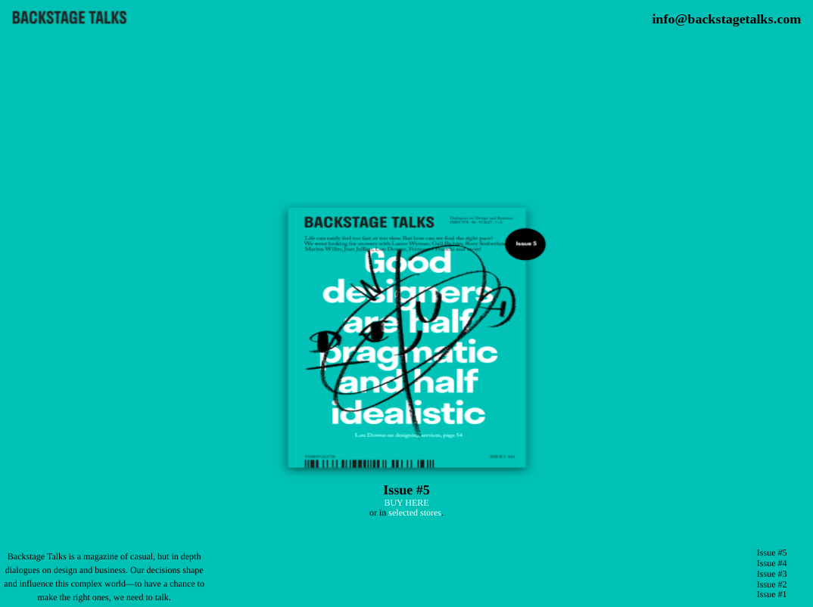
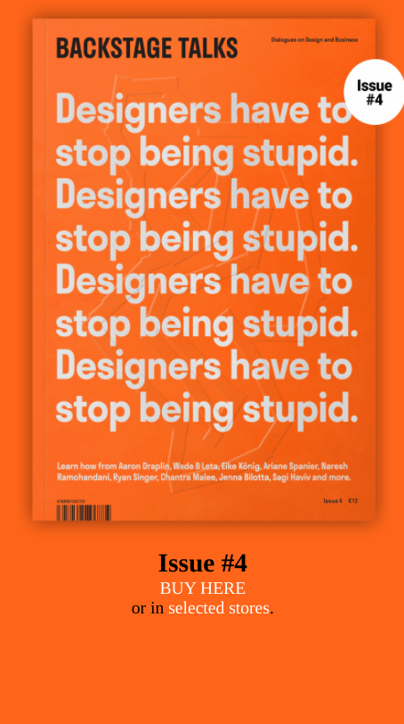

<h1 align="center">Backstage Talks</h1>

   Solution for a challenge from  <a href="https://frontendpractice.com" target="_blank">Frontendpractice.com</a>.

  <h3>
    <a href="https://jdegand.github.io/backstage-talks/">
      Github Pages
    </a>
     | 
    <a href="https://www.frontendpractice.com/project/backstage-talks">
      Frontend Practice    
    </a>
  </h3>

## Table of Contents

- [Overview](#overview)
  - [Built With](#built-with)
- [Features](#features)
- [Useful Resources](#useful-resources)

## Overview

### Built With

- HTML & CSS
- Transitions possible without JS?

## Features

The [challenge](https://www.frontendpractice.com/project/backstage-talks) was to build an application to complete the following user stories:

- [x] User story: Recreate the layout
- [x] User story: Make it Mobile Responsive
- [ ] User story: Create the full page scroll background transitions & anchor links.

## Useful Resources

- [Backstage Talks](https://web.archive.org/web/20210719183800/https://backstagetalks.com/#issue1)
- [Stack Overflow](https://stackoverflow.com/questions/4967976/what-are-the-allowed-tags-inside-a-li) - li rules
- [Medium](https://medium.com/@_patrickcameron/a-complete-beginner-s-guide-to-changing-background-colour-on-scroll-using-jquery-fce686d55049) -jquery implementation
- [Stack Overflow](https://stackoverflow.com/questions/442404/retrieve-the-position-x-y-of-an-html-element-relative-to-the-browser-window) - position x & y
- [FullPage JS](https://alvarotrigo.com/fullPage/) - FullPage JS
- [Stack Overflow](https://stackoverflow.com/questions/26328511/how-to-find-height-of-a-section-of-the-page-below-a-div) - height
- [Reactgo](https://reactgo.com/select-element-data-attribute-js/) - data attributes
- [MDN Docs](https://developer.mozilla.org/en-US/docs/Web/API/Window/getComputedStyle) - getComputedStyle
- [Stack Overflow](https://stackoverflow.com/questions/1248081/how-to-get-the-browser-viewport-dimensions) - browser viewport dimensions
- [Stack Overflow](https://stackoverflow.com/questions/29211998/make-div-max-height-equal-to-window-height-100px) - Window height and calc
